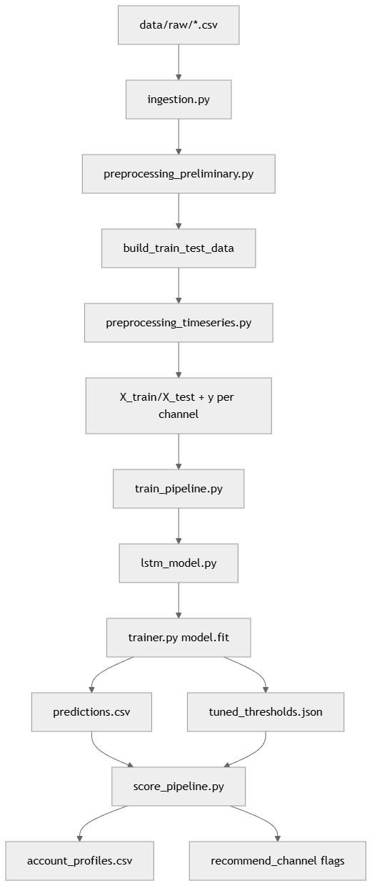

# PharmaStateModels_LSTM

Multichannel HCP propensity modeling project using an LSTM backbone with three binary channel heads:
- `ap_segment_trend`
- `visit`
- `email`

## Scope
- Account-level monthly feature engineering from raw channel data
- Train/test preprocessing with normalization
- Multi-head LSTM training and evaluation
- Threshold tuning per channel (validation F1-based)
- Prediction export and account profile export for downstream business use

## High-Level Workflow
1. Ingest and merge raw multichannel monthly HCP data
2. Build flattened account-level time-series feature table
3. Split accounts into train/test
4. Preprocess time-series tensors for LSTM (`X_train`, `X_test`, per-head labels)
5. Train multi-head LSTM and tune per-head thresholds on validation set
6. Save:
   - predictions + features table
   - tuned thresholds JSON
7. Build account profile table with recommended channel flags using tuned thresholds

## Pipeline Diagram


## Project Structure
```text
PharmaStateModels_LSTM/
  configs/
    base.yaml
  data/
    raw/
    processed/
  docs/
    project_overview.md
  knime/
    workflow_notes.md
  src/pharma_state_models/
    data/
      ingestion.py
      preprocessing.py
      schemas.py
    features/
      sequence_builder.py
    models/
      lstm_model.py
    training/
      trainer.py
    evaluation/
      metrics.py
    inference/
      predictor.py
    pipelines/
      train_pipeline.py
      score_pipeline.py
    utils/
      io.py
      logging_utils.py
    config.py
  tests/
    test_smoke.py
  pyproject.toml
```

## Configuration
Main config: `configs/base.yaml`

Key sections:
- `data.output_predictions_path`: path for train pipeline predictions output
- `scoring.output_profiles_path`: path for account profile output
- `scoring.use_tuned_thresholds`: if `true`, score pipeline loads thresholds from JSON saved by training
- `scoring.tuned_thresholds_path`: path to tuned thresholds JSON
- `scoring.channel_thresholds`: fallback thresholds (used when tuned-threshold file is missing or disabled)

## Run Training Pipeline
```bash
python -m pharma_state_models.pipelines.train_pipeline --config configs/base.yaml
```

Training pipeline outputs:
- `data/processed/predictions.csv`
- `data/processed/tuned_thresholds.json`

`predictions.csv` includes:
- account-level input features
- `*_prob1` per channel
- `dataset_split` (`train` / `test`)

## Run Scoring / Account Profiling Pipeline
```bash
python -m pharma_state_models.pipelines.score_pipeline --config configs/base.yaml
```

Scoring pipeline reads predictions and thresholds, then writes:
- `data/processed/account_profiles.csv`

`account_profiles.csv` includes:
- account id
- channel probabilities (`*_prob1`)
- `top_channel`
- `top_channel_score`
- `recommended_channel`
- `propensity_confidence`
- per-channel recommendation flags (`recommend_*`)

## Notes
- Model is currently multi-output binary classification (sigmoid per channel).
- Email class imbalance handling uses SMOTE on the training set in preprocessing.
- Some modules remain scaffolded for future extension (for example generic sequence builder and standalone evaluation helpers).
